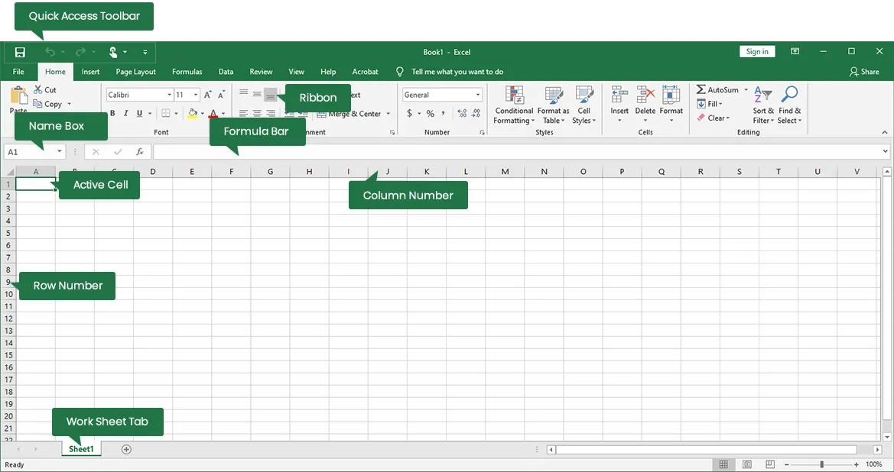
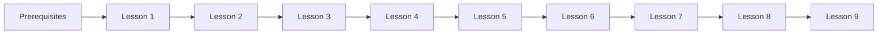

# Getting Started with Excel for Data Analysis

## Welcome to Your Learning Journey!

This guide will help you navigate through our Excel for Data Analysis course efficiently and get the most out of each lesson. The course is designed to take you from Excel basics to advanced data analysis techniques through hands-on practice with real-world datasets.

## Course Overview

Our course consists of 9 progressive lessons that build on each other:

1. **Getting Started with Excel** - Excel interface, basic functionality, cell formatting
2. **Data Importing and Preparation** - Importing data from various sources, data cleaning
3. **Excel Formulas and Functions Basics** - Creating formulas, referencing cells, basic functions
4. **Advanced Excel Functions for Analysis** - VLOOKUP, XLOOKUP, date functions, conditional logic 
5. **Excel Pivot Tables and Pivot Charts** - Data summarization and exploration techniques
6. **Data Visualization and Dashboards** - Charts, conditional formatting, interactive dashboards
7. **Excel Data Analysis Tools** - Statistical tools, what-if analysis, regression
8. **Practical Mini-Project** - End-to-end data analysis project with real-world scenario
9. **Module Review & Q&A** - Comprehensive review, knowledge gaps, extending skills

## Before You Begin

1. **Check Prerequisites**: Make sure you have:
   - [x] Reviewed the [Prerequisites](Prerequisites.md) document
   - [x] Installed Microsoft Excel (2019 or newer recommended)
   - [x] Set up required add-ins (Analysis ToolPak, Solver)

2. **Understanding Course Materials**:
   - Each lesson has a corresponding folder in the Dataset directory with relevant data files
   - Screenshots and visual guides are provided in the Images folder
   - Reference materials are available in the Resources folder

## How to Use This Course

### Step-by-Step Learning Path

1. **Start with Prerequisites** - Ensure you have the necessary foundation
2. **Progress Sequentially** - Each lesson builds on skills learned in previous lessons
3. **Practice with Datasets** - Complete all exercises with the provided datasets
4. **Review and Apply** - Test your knowledge with practice challenges

### Using the Datasets

Each dataset has been carefully selected to match the learning objectives of its lesson:

- **Lesson 1**: Iris Dataset, Amazon Bestselling Books - Perfect for basic Excel operations
- **Lesson 2**: Avocado Prices, Titanic - Great for data cleaning and preparation techniques
- **Lesson 3**: World Happiness Report, Boston Housing - Ideal for practicing formula creation
- **Lesson 4**: Stock Data, FIFA World Cup - Excellent for advanced function practice
- **Lesson 5**: Bank Marketing, Superstore - Perfect for pivot table exercises
- **Lesson 6**: Wine Quality, NYC Airbnb - Great for visualization techniques
- **Lesson 7**: Adult Census, Breast Cancer Wisconsin - Ideal for statistical analysis
- **Lesson 8**: Global Superstore, Online Shoppers - Comprehensive datasets for the mini-project

### Best Practices While Learning

1. **Create Working Copies**: Never modify the original dataset files
2. **Document Your Work**: Add comments to your formulas and create documentation tabs
3. **Save Frequently**: Create versioned files (e.g., "Lesson1_Exercise1_v1.xlsx")
4. **Experiment**: Try alternative approaches to solve the same problem
5. **Complete Practice Exercises**: Found in the Dataset/README.md file

## Excel Settings and Setup

### Recommended Settings

1. **Display Settings**:
   - Enable Formula Bar: View tab → Formula Bar
   - Show gridlines: View tab → Gridlines
   - Freeze panes for large datasets: View tab → Freeze Panes

2. **Calculation Settings**:
   - Set to Automatic: Formulas tab → Calculation Options → Automatic

3. **Add-ins**:
   - Analysis ToolPak: File → Options → Add-ins → Go → Check "Analysis ToolPak"
   - Solver Add-in: File → Options → Add-ins → Go → Check "Solver Add-in"

### Keyboard Shortcuts for Efficiency

| Action | Windows Shortcut | Mac Shortcut |
|--------|-----------------|-------------|
| Copy | Ctrl+C | ⌘+C |
| Paste | Ctrl+V | ⌘+V |
| Save | Ctrl+S | ⌘+S |
| Bold | Ctrl+B | ⌘+B |
| Insert function | Shift+F3 | Shift+F3 |
| Edit cell | F2 | F2 |
| Fill down | Ctrl+D | ⌘+D |

For more shortcuts, see [ExcelShortcuts.md](Resources/ExcelShortcuts.md).

## Tracking Your Progress

Use the table below to track your progress through the course:

| Lesson | Date Started | Date Completed | Exercises Done | Confidence (1-5) | Notes |
|--------|--------------|----------------|---------------|--------------------|-------|
| 1      |              |                |               |                    |       |
| 2      |              |                |               |                    |       |
| 3      |              |                |               |                    |       |
| 4      |              |                |               |                    |       |
| 5      |              |                |               |                    |       |
| 6      |              |                |               |                    |       |
| 7      |              |                |               |                    |       |
| 8      |              |                |               |                    |       |
| 9      |              |                |               |                    |       |

## Getting Help

If you encounter challenges during the course:

1. **Check the Resources**:
   - [TroubleshootingGuide.md](Resources/TroubleshootingGuide.md) for common issues
   - [FormulaReference.md](Resources/FormulaReference.md) for function syntax help
   - [DataAnalysisGlossary.md](Resources/DataAnalysisGlossary.md) for terminology

2. **Practice Excel Help Features**:
   - Use the "Tell me what you want to do" search box in Excel
   - Press F1 for context-sensitive help
   - Right-click on functions for quick help

## Ready to Begin?

Start your Excel for Data Analysis journey with [Lesson 1: Getting Started with Excel](Lesson1.md).

Happy learning and data exploring!

---

*Note: This course is designed to be completed at your own pace. We recommend spending sufficient time practicing with each dataset before moving to the next lesson.*
