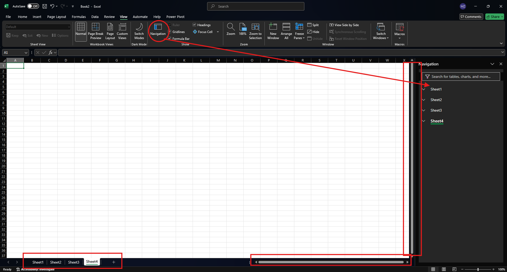
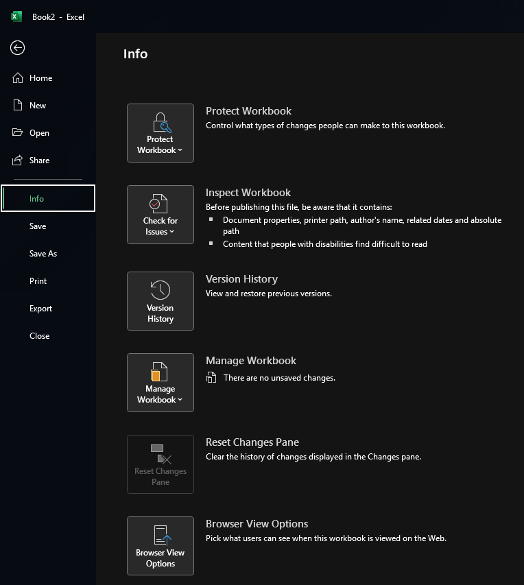
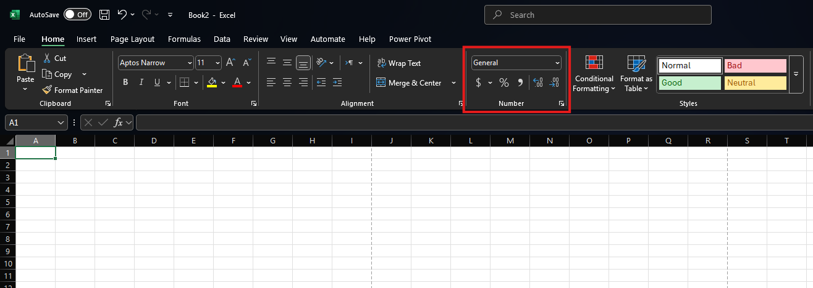
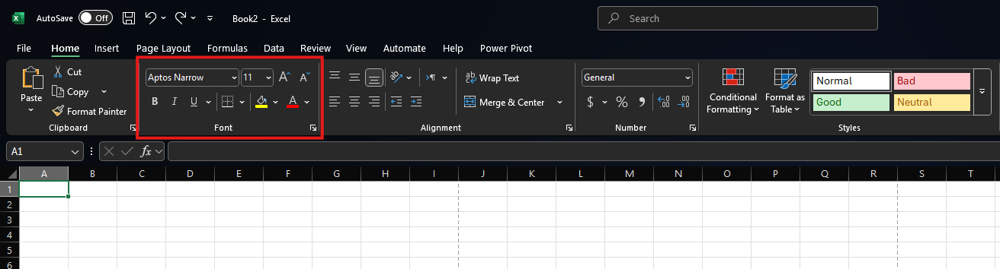
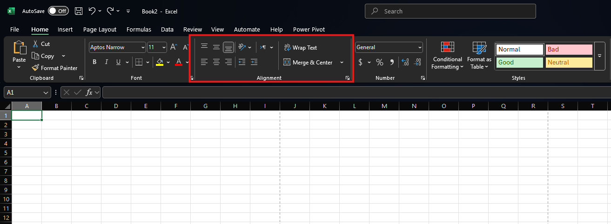
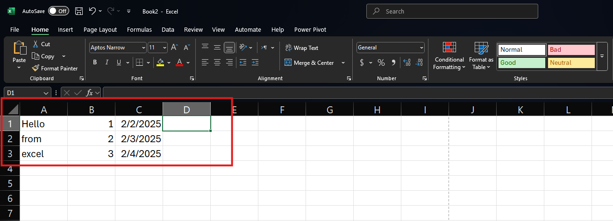
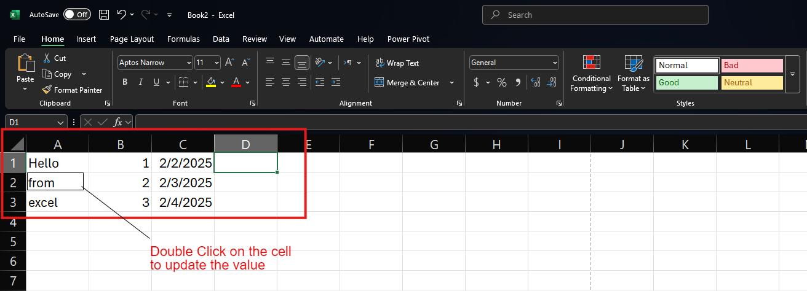
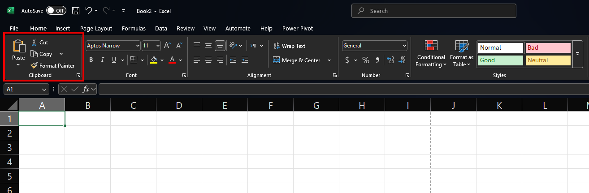

# 📊 Lesson 1: Getting Started with Excel

## 🎯 Learning Objectives:

* Become familiar with the core components of the Excel user interface.
* Understand how to create, open, save, and manage Excel workbook files.
* Learn fundamental techniques for formatting data within cells for clarity and presentation.
* Master basic data entry, editing, and copying methods.

---

## 📚 Topics Covered:

### 1. Excel Overview: Navigating Your Workspace

* **The Excel Interface:** Get acquainted with the essential tools:

  * ✨ **Ribbon:** Your command center with tabs (File, Home, Insert, etc.) organizing features.
  * 🔧 **Quick Access Toolbar (QAT):** Customizable shortcuts for your favorite commands (Save, Undo, Redo).
  * ∑ **Formula Bar:** View and edit data/formulas in the active cell.
  * 📍 **Name Box:** See the address (e.g., A1) of your selected cell.

  
  *The main components of the Excel interface labeled for easy identification*
* **Worksheets:** Manage the pages within your workbook:

  * Learn to add (`+`), delete, rename (double-click), and switch between sheets.

  
  *Working with worksheet tabs at the bottom of the Excel window*
* **Cells & Navigation:** Master movement within the grid:

  * Understand Rows (numbered) & Columns (lettered).
  * Select cells, ranges, rows, and columns.
  * Navigate efficiently using mouse, arrow keys, and shortcuts (Ctrl + Arrows, Home, Ctrl + Home/End).

### 2. Workbook Management: Handling Your Files

* **Creating:** Start fresh with a blank workbook or use helpful templates.
* **Opening:** Access existing `.xlsx`, `.xls`, or `.csv` files.
* **Saving:**

  * `Save`: Updates the current file.
  * `Save As`: Creates a new copy, changes the name, or selects a different format (like `.xlsx` or `.csv`).

  
  *Creating, saving, and opening Excel workbooks*

### 3. Cell Formatting: Making Data Look Good

* **Number Formats:** Display data appropriately:

  * Use `General`, `Number`, `Currency`, `Accounting`, `Date`, `Time`, `Percentage`, etc.
  * > **Note:** Formatting changes appearance, not the underlying value!
    >

  
  *Examples of the same number value displayed in different number formats*
* **Text Formatting:** Style your text:

  * Apply **Bold**, *Italics*, Underline, change Font (style, size, color).

  
  *Text formatting options in the Home tab ribbon*
* **Alignment:** Position data within cells:

  * Horizontal (Left, Center, Right) & Vertical (Top, Middle, Bottom).
  * `Wrap Text`: Fit long text into a cell.
  * `Merge & Center`: Combine cells for titles.

  
  *Different cell alignment options and their effects*

### 4. Basic Spreadsheet Practices: Working with Data

* **Entering Data:** Type text, numbers, or dates into the active cell.

  
  *Different types of data being entered into an Excel worksheet*
* **Editing Data:** Modify cell content (double-click, type over, use Formula Bar).

  
  *Different methods for editing cell content in Excel*
* **Copying & Pasting:** Duplicate data efficiently:

  * Shortcuts: `Ctrl+C` (Copy), `Ctrl+V` (Paste).
  * Ribbon/Right-click options.
  * ✨ **Paste Special:** Paste only values, formatting, formulas, or transpose data.

  
  *Different copy and paste options including Paste Special dialog*

---

## ✨ Key Takeaways:

> * Excel uses a **Ribbon** for commands and a grid of **Cells** organized into **Worksheets**.
> * Mastering **navigation** and basic **file management** (Create, Open, Save) is crucial.
> * **Formatting** enhances readability without changing the core data.
> * Basic **data entry, editing, and copy/paste** are fundamental skills.

---

## 🛠️ Activities: Working with Real Datasets

### Activity 1: Amazon Bestselling Books Analysis

* **Dataset:** `bestsellers with categories.csv` (found in Dataset/Lesson1 folder)
* **Goal:** Import and format a CSV file of Amazon bestselling books.
* **Steps:**
  1. 🚀 **Launch Excel:** Open a new, blank workbook.
  2. 📂 **Import Data:** Click on the Data tab > From Text/CSV > navigate to the Dataset/Lesson1 folder and select `bestsellers with categories.csv`.
  3. 💾 **Save:** Save the workbook as `Amazon_Bestsellers_Analysis.xlsx`.
  4. 📝 **Rename Sheet:** Rename the sheet to `Books Data`.
  5. 🎨 **Format Headers:** Select row 1 (headers). Apply **Bold** formatting and add a light blue background fill color.
  6. 💲 **Format Price:** Select the `Price` column and apply the `Currency` format with 2 decimal places.
  7. 🔢 **Format Years:** Select the `Year` column and apply the `Number` format with 0 decimal places.
  8. ↔️ **Column Width:** Adjust column widths for better readability (double-click on column dividers or use Format > Column Width).
  9. 🔍 **Data Exploration:** Scroll through the data to become familiar with the structure and content.
  10. 💾 **Save Changes:** Save your formatted workbook.

### Activity 2: Iris Dataset Visualization

* **Dataset:** `iris.csv` (found in Dataset/Lesson1 folder)
* **Goal:** Create a formatted table to visualize the Iris dataset.
* **Steps:**
  1. 🚀 **Open Excel:** Create a new workbook (or new sheet in your existing workbook).
  2. 📂 **Import Data:** Import the `iris.csv` file using Data tab > From Text/CSV.
  3. 💾 **Save:** If using a new workbook, save it as `Iris_Dataset_Practice.xlsx`.
  4. 📝 **Rename Sheet:** Name the sheet `Iris Flowers Data`.
  5. 🎨 **Format Table:** Convert the data to a table (Ctrl+T or Insert tab > Table). Choose a table style you like.
  6. 🔢 **Format Numbers:** Select the numerical columns (sepal length/width, petal length/width) and format them to Number with 1 decimal place.
  7. 📊 **Color Coding:** Use conditional formatting on the species column to highlight different species with different colors:
     * Select the species column > Home tab > Conditional Formatting > Highlight Cell Rules > Equal To > Enter "setosa" > Choose a color
     * Repeat for "versicolor" and "virginica" with different colors
  8. ⚙️ **Freeze Headers:** Keep headers visible by using View tab > Freeze Panes > Freeze Top Row.
  9. 🔄 **Sort & Filter:** Practice using the filter buttons in the header row to sort species alphabetically.
  10. 💾 **Save Changes:** Save your formatted workbook.

### Bonus Challenge: Create a Summary Sheet

* Create a new sheet named "Summary"
* In cell A1, type "Amazon Bestsellers Summary" and format it as a title
* In cell A3, create a cell that counts the total number of books in the dataset (Hint: use COUNTA function)
* In cell A4, list the average price of all books (without using formulas yet - we'll cover that in later lessons)
* Apply professional formatting to make your summary sheet visually appealing

---
