# 🧹 Lesson 2: Data Importing and Preparation

## 🎯 Learning Objectives:

* Learn how to import data into Excel from various common sources.
* Identify and handle common data issues like missing or incorrect values.
* Master techniques for sorting and filtering data to isolate relevant information.
* Apply essential data cleaning tools like Text-to-Columns and Remove Duplicates.

---

## 📚 Topics Covered:

### 1. Importing Data: Getting Data into Excel

* **Sources:** Learn the methods for bringing external data into your worksheet:

  * 📄 **CSV (Comma Separated Values) & Text Files (.txt):** Use the `Data` tab > `Get & Transform Data` > `From Text/CSV` wizard. Understand delimiters (comma, tab, semicolon) and data type detection.

  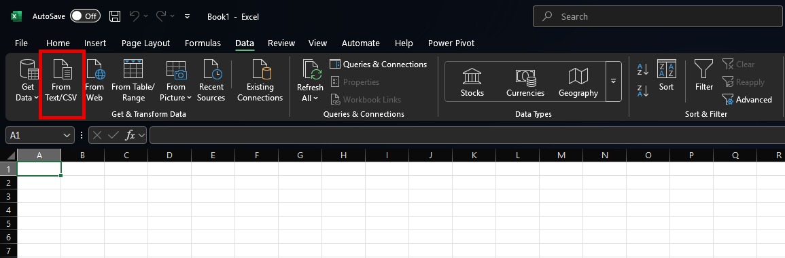

  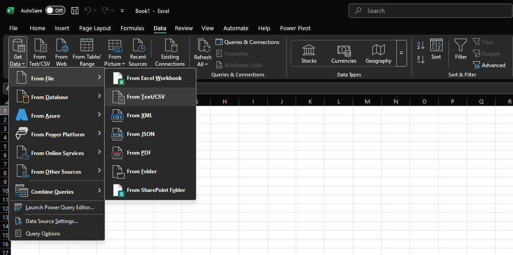

  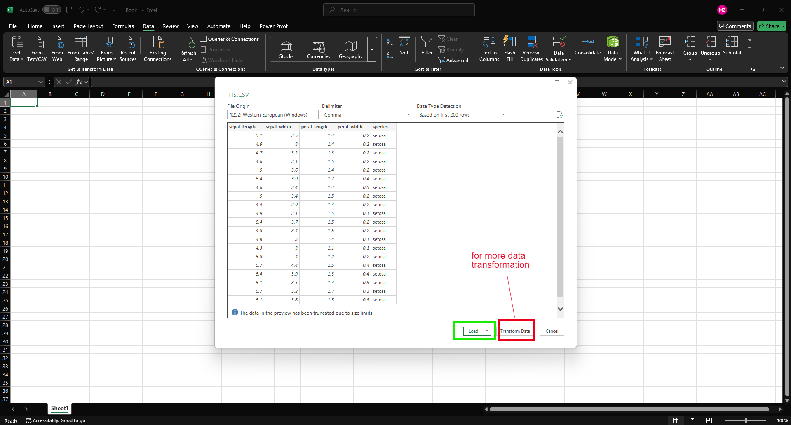

  * 🗄️ **Databases (Basic Introduction):** Briefly introduce connecting to simple databases (like Access or SQL Server) via `Data` tab > `Get Data` > `From Database` (mentioning this might require specific drivers or permissions).
  * 🌐 **Web (Mention):** Briefly mention the possibility of importing data from web pages (`Data` tab > `Get Data` > `From Web`).

  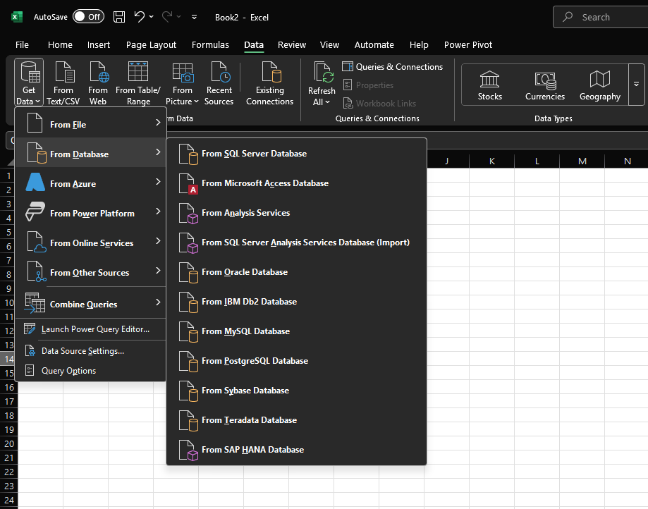
  *Options for importing data from databases*

  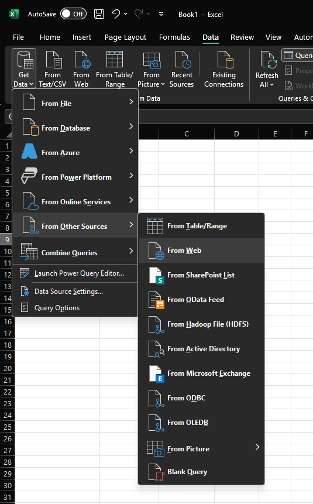
  *Options for importing data from web sources*

* **The Import Process:** Understand the steps involved, including previewing data, choosing load destinations (new worksheet vs. existing), and basic transformation options available during import.

  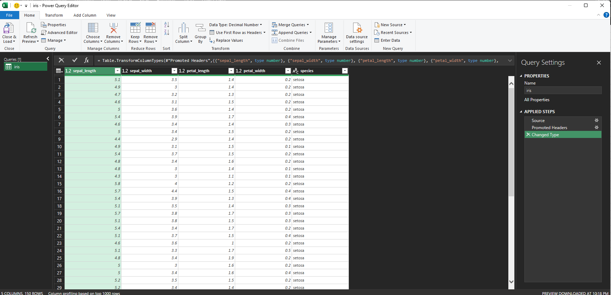
  *The Excel data import wizard showing preview and transformation options*

### 2. Data Quality: Dealing with Imperfections

* **Identifying Issues:** Learn visual scanning techniques and tools to spot problems:

  * **Missing Data:** Recognizing blank cells where data should exist.
  * **Incorrect Data:** Spotting typos, inconsistent formatting (e.g., dates as text), outliers, or values that don't make sense in context.

  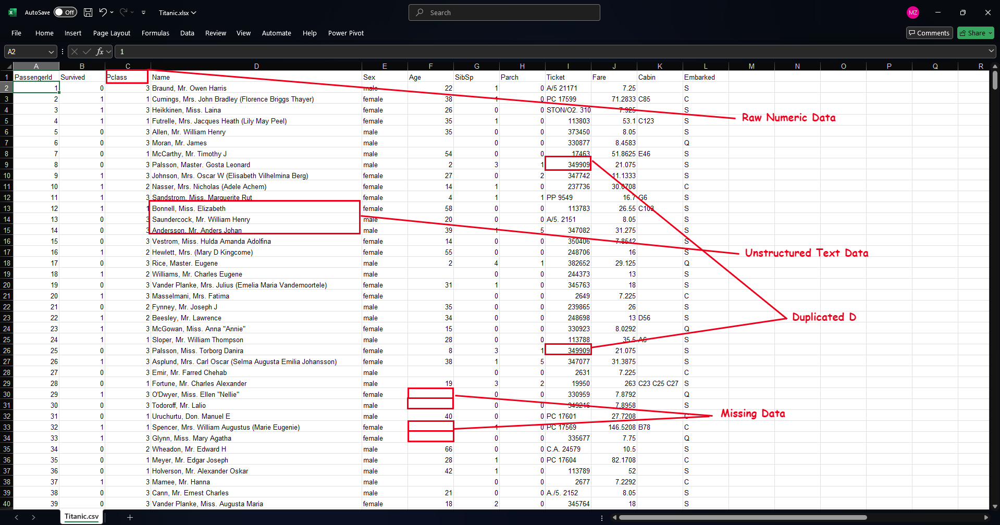
  *Examples of common data quality issues like missing values and inconsistent formatting*
* **Handling Strategies:**

  * **Missing Values:** Discuss options like deleting rows/columns (use with caution!), filling with a specific value (0, "N/A", mean, median - depending on context), or using more advanced imputation techniques (mention briefly).
  * **Incorrect Values:** Correcting typos manually, using Find & Replace (`Ctrl+H`), or applying consistent formatting.


  ```mermaid
  flowchart TD
    A[Identify Missing Values] --> B{Evaluate Impact}
    B --> C[Few Missing Values]
    B --> D[Many Missing Values]

    C --> E[Deletion Methods]
    C --> F[Replacement Methods]
    D --> G[Pattern Analysis]
    D --> H[Advanced Techniques]

    E --> E1[Delete Rows]
    E --> E2[Delete Columns]

    F --> F1[Replace with Zero]
    F --> F2[Replace with N/A or NULL]
    F --> F3[Replace with Statistical Value]

    F3 --> F3a[Mean]
    F3 --> F3b[Median]
    F3 --> F3c[Mode]

    G --> G1[Look for Patterns in Missing Data]
    G --> G2[Conditional Handling]

    H --> H1[Regression Models]
    H --> H2[Multiple Imputation]
    H --> H3[External Data Sources]

    style A fill:#5D4E7B,stroke:#8BE9FD,stroke-width:2px,color:#F8F8F2
    style B fill:#6272A4,stroke:#8BE9FD,stroke-width:2px,color:#F8F8F2
    style C fill:#44475A,stroke:#8BE9FD,stroke-width:1px,color:#F8F8F2
    style D fill:#44475A,stroke:#8BE9FD,stroke-width:1px,color:#F8F8F2
    style E fill:#44475A,stroke:#8BE9FD,stroke-width:1px,color:#F8F8F2
    style F fill:#44475A,stroke:#8BE9FD,stroke-width:1px,color:#F8F8F2
    style G fill:#44475A,stroke:#8BE9FD,stroke-width:1px,color:#F8F8F2
    style H fill:#44475A,stroke:#8BE9FD,stroke-width:1px,color:#F8F8F2
    style F3 fill:#50FA7B,stroke:#44475A,stroke-width:1px,color:#282A36
    style E1 fill:#383A59,stroke:#BD93F9,stroke-width:1px,color:#F8F8F2
    style E2 fill:#383A59,stroke:#BD93F9,stroke-width:1px,color:#F8F8F2
    style F1 fill:#383A59,stroke:#BD93F9,stroke-width:1px,color:#F8F8F2
    style F2 fill:#383A59,stroke:#BD93F9,stroke-width:1px,color:#F8F8F2
    style F3a fill:#383A59,stroke:#50FA7B,stroke-width:1px,color:#F8F8F2
    style F3b fill:#383A59,stroke:#50FA7B,stroke-width:1px,color:#F8F8F2
    style F3c fill:#383A59,stroke:#50FA7B,stroke-width:1px,color:#F8F8F2
  ```

  *Strategies for dealing with missing values in Excel*

### 3. Organizing Data: Sorting & Filtering

* **Sorting:** Arranging data in a meaningful order:

  * **Single Column Sort:** Use the `Data` tab > `Sort & Filter` > `A-Z` (ascending) or `Z-A` (descending) buttons.
  * **Multi-Level Sort:** Use the `Sort` dialog box (`Data` tab > `Sort`) to sort by multiple columns sequentially (e.g., sort by Region, then by Sales). Understand sorting options (values, cell color, font color).

  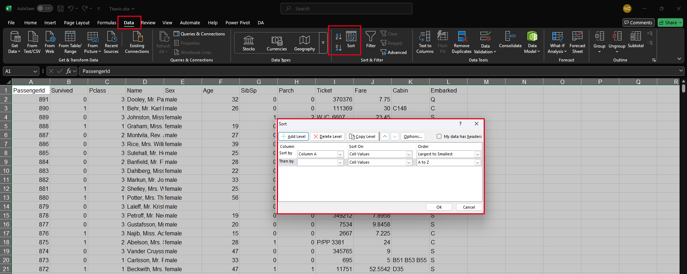
  *Single-column and multi-level sorting options in Excel*
* **Filtering:** Displaying only the data that meets specific criteria:

  * **AutoFilter:** Enable filter dropdown arrows on headers (`Data` tab > `Filter` or `Ctrl+Shift+L`).
  * **Using Filters:** Filter by specific values, text criteria (contains, begins with), number criteria (greater than, between), date criteria (this month, next year), or cell color/font color.
  * **Clearing Filters:** Removing filters to show all data again.

  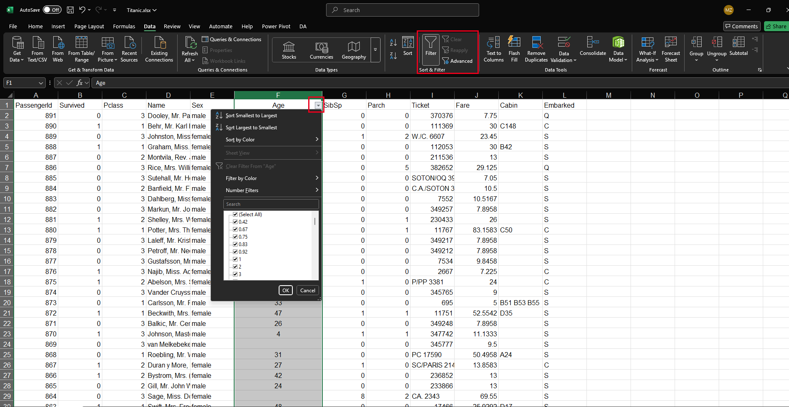
  *Using AutoFilter to display only specific data based on criteria*

### 4. Basic Data Cleaning Tools

* **Text-to-Columns:** Splitting data from a single column into multiple columns:

  * Located on the `Data` tab > `Data Tools` group.
  * Use cases: Separating full names into first and last names, splitting delimited data pasted into a single column.
  * Understand `Delimited` (using characters like commas, spaces, tabs) vs. `Fixed Width` options.

  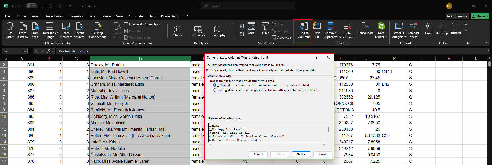
  *Using Text to Columns to split full names into first and last names*
* **Removing Duplicates:** Identifying and deleting entire rows that are identical based on selected columns:

  * Located on the `Data` tab > `Data Tools` group.
  * Select the data range, choose which columns to check for duplicates.
  * > **Caution:** This permanently deletes rows. Consider copying data first if unsure.
    >

  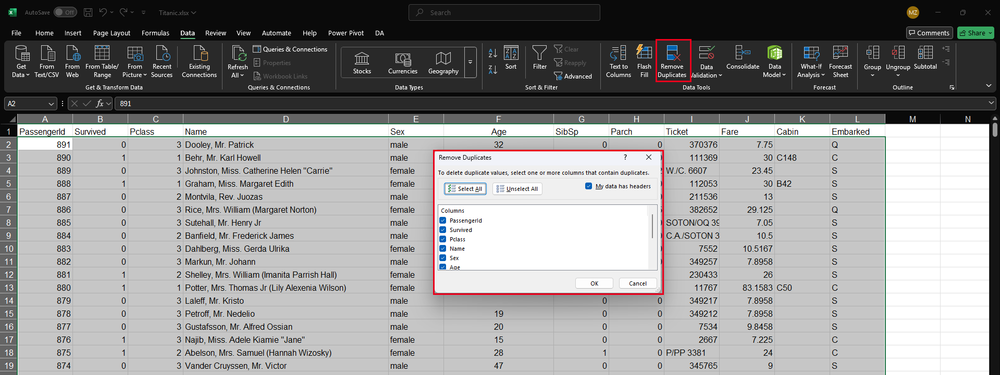
  *The Remove Duplicates dialog allowing selection of columns to check*
* **Find & Replace (`Ctrl+H`):** Useful for correcting consistent errors or standardizing terms (e.g., replacing "USA" with "United States").

  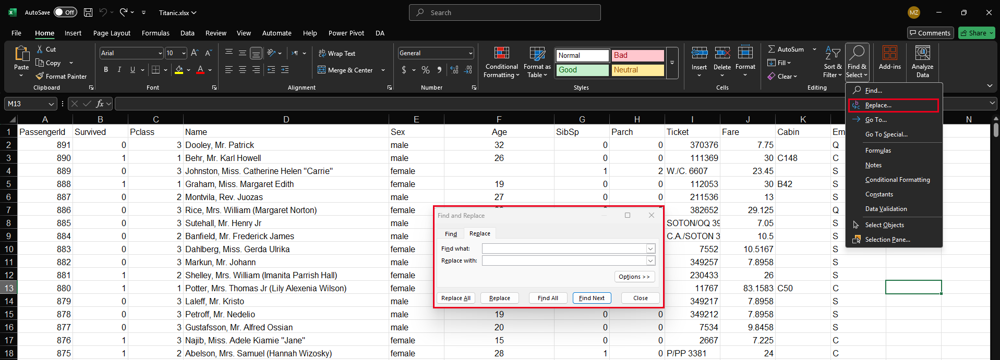
  *Using Find and Replace to standardize text values across a dataset*

---

## ✨ Key Takeaways:

> * Excel can import data from various sources like **CSV, Text files**, and databases using the **Get & Transform Data** tools.
> * Data often requires **cleaning** to handle **missing or incorrect** values before analysis.
> * **Sorting** arranges data logically; **Filtering** isolates specific subsets of data.
> * Tools like **Text-to-Columns** and **Remove Duplicates** are essential for basic data preparation.

---

## 🛠️ Activities: Data Cleaning and Preparation

### Activity 1: Avocado Price Data Cleaning

* **Dataset:** `avocado.csv` (found in Dataset/Lesson2 folder)
* **Goal:** Import, clean, and organize historical avocado price data.
* **Steps:**
  1. 📥 **Import Data:** Use `Data` > `From Text/CSV` to import the `avocado.csv` file. Review the preview and ensure data types are correct before loading.
  2. 💾 **Save:** Save the workbook as `Avocado_Price_Analysis.xlsx`.
  3. 📝 **Rename Sheet:** Name the worksheet "Avocado Data".
  4. 📅 **Date Formatting:** Select the `Date` column, format it as a proper date using Format Cells > Number > Date.
  5. 💲 **Price Formatting:** Apply Currency format to the `AveragePrice` column with 2 decimal places.
  6. 🔢 **Number Formatting:** Format all volume columns (Total Volume, 4046, 4225, 4770, Total Bags, etc.) as Number format with 0 decimal places.
  7. 🧹 **Clean Regions:** Examine the `region` column for any inconsistencies in naming. Use Find & Replace (Ctrl+H) to standardize any region names if needed.
  8. 📊 **Create Types Sheet:** Create a new worksheet called "By Type". Use filtering and copy/paste to create separate tables for "conventional" and "organic" avocados.
  9. ⇅ **Sort Data:** On the original sheet, sort the data by date (oldest to newest) and then by region.
  10. ⚙️ **Freeze Headers:** Use View > Freeze Panes to keep column headers visible when scrolling.

### Activity 2: Titanic Passenger Data Analysis

* **Dataset:** `Titanic.xlsx` (found in Dataset/Lesson2 folder)
* **Goal:** Clean and prepare the Titanic passenger dataset for analysis.
* **Steps:**
  1. 📂 **Open File:** Open the `Titanic.xlsx` file from the Dataset/Lesson2 folder.
  2. 💾 **Save As:** Save a working copy as `Titanic_Analysis.xlsx`.
  3. 🔍 **Inspect Data:** Review the dataset to understand the columns and identify potential issues.
  4. 🙍‍♀️ **Extract Titles:** Create a new column called "Title". Use Data > Text to Columns or formulas to extract titles (Mr., Mrs., Miss, etc.) from the Name column.
  5. 🚫 **Missing Values:** Identify missing values in the Age column. Mark these cells with a distinctive fill color for now.
  6. 🧮 **Create Age Groups:** Add a new column called "Age Group" and categorize passengers as:
     * Child: < 18
     * Adult: 18-60
     * Senior: > 60
     * Unknown: Missing age
  7. 🖌️ **Color Code Survival:** Use Conditional Formatting to highlight survivors (Survived = 1) in green and non-survivors (Survived = 0) in red.
  8. 📋 **Remove Duplicates:** Check for and remove any duplicate entries based on PassengerID.
  9. 🏷️ **Create Class Labels:** Replace the Pclass values (1, 2, 3) with descriptive labels ("First Class", "Second Class", "Third Class") using Find & Replace.
  10. ⚙️ **Enable Filtering:** Use Data > Filter to add filter dropdown menus to all columns.

### Bonus Challenge: Combining Data Analysis

* Create a new sheet called "Survival Analysis"
* Create a summary table showing survival counts by:
  * Gender (Male/Female)
  * Passenger Class (First/Second/Third)
  * Age Group (Child/Adult/Senior/Unknown)
* Format this summary sheet with appropriate colors, borders, and header styles
* Add data bars or conditional formatting to visually represent the survival rates
