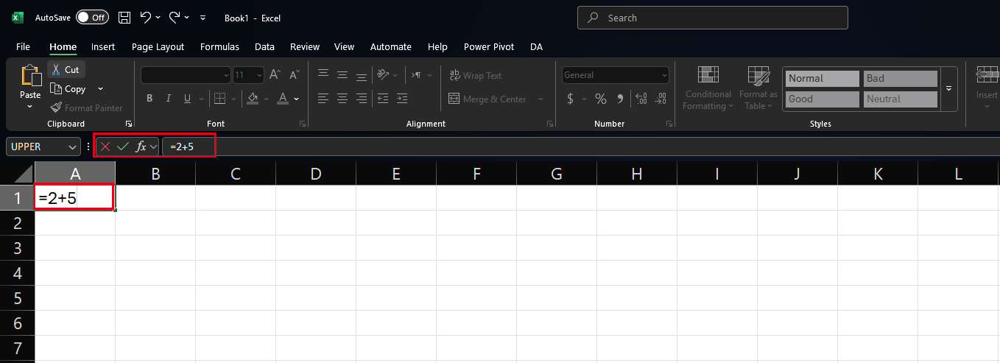
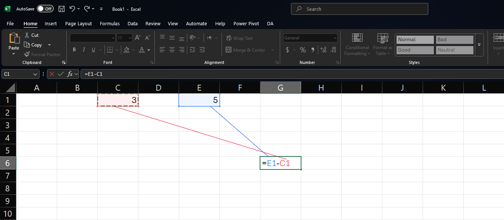
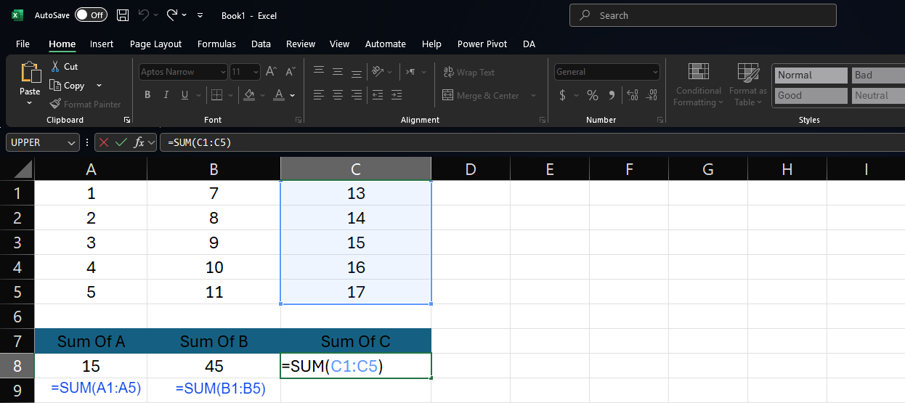
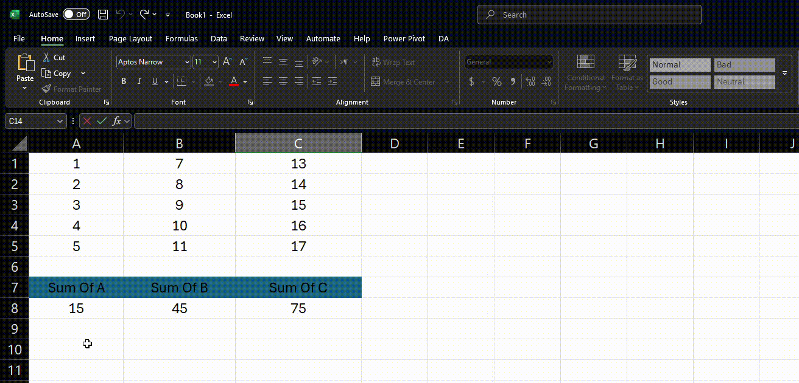
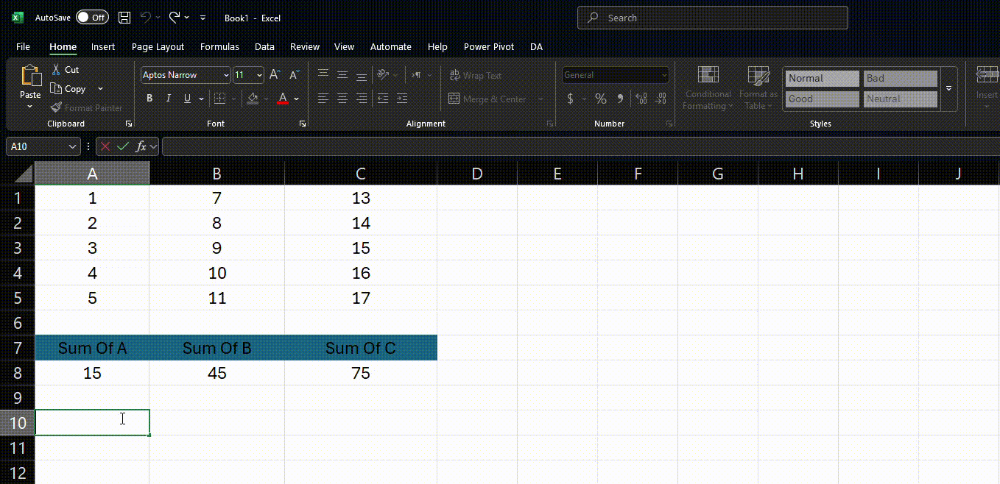
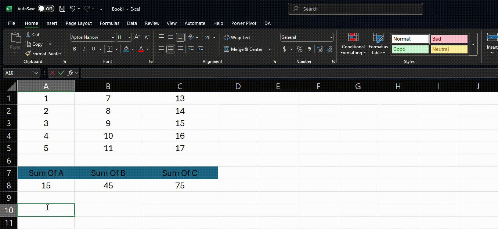

# 🧮 Lesson 3: Excel Formulas and Functions Basics

## 🎯 Learning Objectives:

* Understand the structure and syntax of Excel formulas.
* Master the difference between relative, absolute, and mixed cell referencing.
* Learn to use fundamental mathematical, logical, and text functions for data analysis.
* Recognize common Excel formula errors and understand basic error handling.

---

## 📚 Topics Covered:

### 1. Understanding Excel Formulas

* **The Basics:**

  * All formulas start with an equals sign (`=`).
  * Use standard arithmetic operators: `+` (Add), `-` (Subtract), `*` (Multiply), `/` (Divide), `^` (Exponent).
  * **Order of Operations (PEMDAS/BODMAS):** Parentheses/Brackets, Exponents/Orders, Multiplication/Division (from left to right), Addition/Subtraction (from left to right).

  
  *Example of a basic formula in Excel showing the components*
* **Cell Referencing:** Pointing to other cells to use their values in calculations.

  * **Single Cell:** `=A1+B1`
  * **Range:** `=SUM(C1:C10)` (Calculates the sum of cells C1 through C10).

  
  *Example showing how cell references work in formulas*

  <!-- range image -->
  

### 2. Absolute vs. Relative Referencing: The Power of the `$`

* **Relative Referencing (Default):** References adjust automatically when you copy/paste or fill a formula. If you copy `=A1+B1` from cell `C1` down to `C2`, it becomes `=A2+B2`.

  * *Example:* `A1`

  
  *Example showing how relative references change when copied down or across*
* **Absolute Referencing:** References **do not** change when copied/filled. Use the dollar sign (`$`) before the column letter and row number.

  * *Example:* `$A$1` (Always refers to cell A1, no matter where the formula is copied).

  
  *Example showing how absolute references stay fixed when copied*
* **Mixed Referencing:** Either the row or the column is absolute, while the other is relative.

  * *Example:* `$A1` (Column A is fixed, row adjusts when copied vertically).
  * *Example:* `A$1` (Row 1 is fixed, column adjusts when copied horizontally).
  * > **Pro Tip:** Use the `F4` key while editing a cell reference in the formula bar to cycle through relative, absolute, and mixed options!
    >

  
  *Example showing how mixed references partially adjust when copied*

### 3. Commonly Used Excel Functions for Analysis

* **Functions** are pre-built formulas that perform specific calculations.
* **Syntax:** `=FUNCTIONNAME(argument1, argument2, ...)`

* **Basic Math Functions:**

  * `SUM(range)`: Adds all numbers in a range of cells. *Ex: `=SUM(A1:A10)`*
  * `AVERAGE(range)`: Calculates the average of numbers in a range. *Ex: `=AVERAGE(B1:B10)`*
  * `COUNT(range)`: Counts how many cells in a range contain numbers. *Ex: `=COUNT(C1:C10)`*
  * `COUNTA(range)`: Counts how many cells in a range are not empty (contain numbers, text, etc.). *Ex: `=COUNTA(D1:D10)`*
  * `MIN(range)`: Finds the smallest number in a range. *Ex: `=MIN(E1:E10)`*
  * `MAX(range)`: Finds the largest number in a range. *Ex: `=MAX(F1:F10)`*

* **Logical Functions:** Used for decision-making.

  * `IF(logical_test, value_if_true, value_if_false)`: Returns one value if a condition is true, and another if it's false. *Ex: `=IF(A1>10, "Pass", "Fail")`*
  * `AND(logical1, [logical2], ...)`: Returns `TRUE` if ALL arguments are true, otherwise `FALSE`. Often used within `IF`. *Ex: `=IF(AND(A1>10, B1="Active"), "Proceed", "Stop")`*
  * `OR(logical1, [logical2], ...)`: Returns `TRUE` if ANY argument is true, otherwise `FALSE`. Often used within `IF`. *Ex: `=IF(OR(A1="Shipped", B1="Delivered"), "Complete", "Pending")`*

* **Text Functions:** Used for manipulating text strings.

  * `CONCATENATE(text1, [text2], ...)` or using the `&` operator: Joins several text strings into one. *Ex: `=CONCATENATE(A1, " ", B1)` or `=A1 & " " & B1` (to join first and last names with a space).
  * `LEFT(text, num_chars)`: Returns a specified number of characters from the start of a text string. *Ex: `=LEFT(A1, 3)` (gets the first 3 characters).
  * `RIGHT(text, num_chars)`: Returns a specified number of characters from the end of a text string. *Ex: `=RIGHT(A1, 2)` (gets the last 2 characters).
  * `LEN(text)`: Returns the number of characters in a text string (length). *Ex: `=LEN(A1)`*

### 4. Error Handling in Excel Formulas

* **Common Errors & Meanings:**

  * `#DIV/0!`: Trying to divide by zero.
  * `#N/A`: A value is not available to a function or formula (common with lookups).
  * `#NAME?`: Excel doesn't recognize text in a formula (e.g., misspelled function name).
  * `#NULL!`: Specifies an invalid intersection of two areas.
  * `#NUM!`: Invalid numeric values in a formula or function (e.g., square root of a negative number).
  * `#REF!`: A cell reference is not valid (e.g., cell was deleted).
  * `#VALUE!`: Wrong type of argument or operand is used (e.g., adding text to a number).

* **Basic Handling with `IFERROR`:**

  * `IFERROR(value, value_if_error)`: Checks if the first part results in an error. If it does, it returns the `value_if_error`; otherwise, it returns the result of the `value`.
  * *Ex: `=IFERROR(A1/B1, "Cannot Divide")` (Instead of showing `#DIV/0!`, it will show "Cannot Divide" if B1 is 0).

---

## ✨ Key Takeaways:

> * Formulas start with `=` and use **cell references** and **operators**.
> * Understanding **relative vs. absolute (`$`) referencing** is crucial for copying formulas correctly.
> * **Functions** (`SUM`, `AVERAGE`, `IF`, `CONCATENATE`, etc.) automate common calculations and tasks.
> * Recognizing **formula errors** helps in troubleshooting, and **`IFERROR`** can provide cleaner outputs.

---

## 🛠️ Activities: Working with Real Data

### Activity 1: World Happiness Report Analysis

* **Datasets:** `2015.csv`, `2016.csv`, `2017.csv`, `2018.csv`, `2019.csv` (found in Dataset/Lesson3 folder)
* **Goal:** Apply basic functions and formulas to analyze global happiness data across multiple years.
* **Steps:**
  1. 📥 **Import Data:** Create a new workbook and import the World Happiness Report CSV files into separate worksheets. Name each sheet by its year (e.g., "2015", "2016", etc.).
  2. 💾 **Save:** Save the workbook as `World_Happiness_Analysis.xlsx`.
  3. 🌐 **Create Summary Sheet:** Add a new sheet named "Summary" at the beginning of the workbook.
  4. 🧮 **Calculate Yearly Averages:** In the Summary sheet, create a table with years (2015-2019) in rows and the following happiness factors in columns:
     * Happiness Score
     * Economy (GDP per Capita)
     * Family/Social Support
     * Health (Life Expectancy)
     * Freedom
     * Trust (Government Corruption)
     * Generosity
  5. 🔢 **Use AVERAGE Function:** For each year and factor, use the AVERAGE function to calculate the global average. Example: `=AVERAGE('2015'!D2:D159)` to calculate average happiness score from 2015 sheet.
  6. 📊 **Find Top and Bottom Countries:** For each year, use MAX, MIN, and appropriate lookup functions to identify:
     * Country with highest happiness score
     * Country with lowest happiness score
     * Country with highest GDP per capita
     * Country with lowest trust in government
  7. 🧠 **Create Logical Calculations:** Add a column in each year's sheet that classifies countries as:
     * "Very Happy" if happiness score > 7
     * "Happy" if happiness score is between 5.5 and 7
     * "Average" if happiness score is between 4 and 5.5
     * "Unhappy" if happiness score < 4
     * Use nested IF functions: `=IF(D2>7,"Very Happy",IF(D2>5.5,"Happy",IF(D2>4,"Average","Unhappy")))`
  8. 📈 **Calculate Year-to-Year Changes:** For 2016-2019 sheets, add a column that calculates the change in happiness score from the previous year.
  9. 🧩 **Format All Calculations:** Apply appropriate number formatting to all calculated values.
  10. 📋 **Add Data Validation:** In a new section of your Summary sheet, add data validation to create a dropdown list of countries, allowing users to select a specific country to view its happiness data across all years.

### Activity 2: Boston Housing Data Analysis

* **Dataset:** `boston.csv` (found in Dataset/Lesson3 folder)
* **Goal:** Use Excel formulas to analyze housing data and derive insights.
* **Steps:**
  1. 📂 **Import Data:** Import the `boston.csv` file into a new workbook.
  2. 💾 **Save:** Save the workbook as `Boston_Housing_Analysis.xlsx`.
  3. 📝 **Rename Sheet:** Name the worksheet "Housing Data".
  4. 🔍 **Data Exploration:** Review the dataset to understand the columns:
     * CRIM: Crime rate
     * ZN: Proportion of residential land zoned
     * INDUS: Proportion of non-retail business acres
     * CHAS: Charles River dummy variable
     * NOX: Nitric oxide concentration
     * RM: Average number of rooms
     * AGE: Proportion of owner-occupied units built prior to 1940
     * DIS: Weighted distances to employment centers
     * RAD: Index of accessibility to radial highways
     * TAX: Property tax rate
     * PTRATIO: Pupil-teacher ratio
     * B: Result of the equation B=1000(Bk - 0.63)^2 where Bk is the proportion of Black people
     * LSTAT: % lower status of the population
     * MEDV: Median value of owner-occupied homes in $1000s
  5. 📊 **Basic Statistics:** Create a summary section that calculates:
     * Average, Median, Minimum, and Maximum home values (MEDV)
     * Average number of rooms (RM)
     * Average crime rate (CRIM)
     * Use functions: `AVERAGE`, `MEDIAN`, `MIN`, `MAX`
  6. 🏘️ **Create Housing Classifications:** Add a new column "Housing Class" that categorizes homes based on their median value (MEDV):
     * "Luxury" if MEDV > 30
     * "Mid-Range" if MEDV is between 20 and 30
     * "Affordable" if MEDV < 20
     * Use IF function: `=IF(N2>30,"Luxury",IF(N2>20,"Mid-Range","Affordable"))`
  7. 🔗 **Correlation Analysis:** Create a column that calculates if there appears to be a relationship between:
     * Number of rooms (RM) and home value (MEDV)
     * Crime rate (CRIM) and home value (MEDV)
     * Use IF statements to classify as "Strong Positive", "Moderate Positive", "Weak/No Relationship", "Moderate Negative", or "Strong Negative"
  8. 🧮 **Create Calculated Fields:** Add new columns that:
     * Convert MEDV to actual dollar amounts (multiply by 1000)
     * Calculate estimated property tax amount (MEDV × TAX)
     * Create a "livability score" using a weighted formula of your choice combining multiple factors
  9. 📋 **Data Filtering:** Use formulas to count how many neighborhoods have:
     * Above average home values and below average crime rates
     * Above average pupil-teacher ratios (PTRATIO)
     * River frontage (CHAS = 1)
  10. 💾 **Save Your Work:** Ensure all changes are saved.

### Bonus Challenge: Cross-Dataset Analysis

* Create a new sheet called "Combined Analysis"
* Import country GDP data from the World Happiness Report (2019)
* Use lookup functions to find countries with similar GDP per capita to the Boston area
* Create a formula that estimates what Boston's "happiness score" might be based on its statistics
* Format this analysis in a professional manner with appropriate headers and explanations

---
