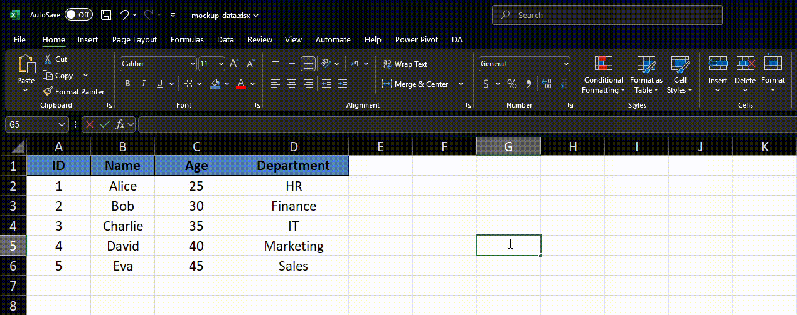

# 🚀 Lesson 4: Advanced Excel Functions for Analysis

## 🎯 Learning Objectives:

* Master lookup functions (`VLOOKUP`, `HLOOKUP`) to find and retrieve data from tables.
* Gain an introductory understanding of the more flexible `INDEX` and `MATCH` combination.
* Learn to work effectively with dates and times using specialized functions.
* Perform calculations based on single or multiple criteria using conditional functions (`SUMIF`, `COUNTIF`, `SUMIFS`, `COUNTIFS`).

---

## 📚 Topics Covered:

### 1. Lookup & Reference Functions: Finding Data

* **`VLOOKUP(lookup_value, table_array, col_index_num, [range_lookup])`:** Searches for a value in the **first column** of a table array and returns the value in the same row from a specified column.

  * `lookup_value`: The value you want to search for.
  * `table_array`: The range containing the data table (must include the lookup column and the return column).
  * `col_index_num`: The column number within the `table_array` from which to return a value (1 is the first column, 2 is the second, etc.).
  * `[range_lookup]`: Optional. `TRUE` (or omitted) finds an approximate match (table must be sorted ascending by the first column). `FALSE` finds an exact match.
  * > **Common Use:** Finding a product price based on a product ID.
    >
  * > **Limitation:** Can only look up based on the *first* column and only look *right*.
    >

  
  *Example of VLOOKUP retrieving Departments information based on Employee ID*
* **`HLOOKUP(lookup_value, table_array, row_index_num, [range_lookup])`:** Similar to `VLOOKUP`, but searches for a value in the **first row** of a table array and returns the value in the same column from a specified row.

  * Arguments are analogous to `VLOOKUP`, but `row_index_num` specifies the row to return from.
  * > **Common Use:** Finding data based on column headers (e.g., finding sales for a specific month when months are headers).
    >

  
  *Example of HLOOKUP retrieving data based on column headers*
* **`INDEX(array, row_num, [column_num])` & `MATCH(lookup_value, lookup_array, [match_type])` (Brief Introduction):** A powerful and flexible alternative to `VLOOKUP`/`HLOOKUP`.

  * `MATCH`: Finds the *position* (row or column number) of a lookup value within a range.
    * `match_type`: `0` for exact match, `1` for less than (requires sorted ascending), `-1` for greater than (requires sorted descending).
  * `INDEX`: Returns the value of a cell at a specific row and column intersection within a given array.
  * **Combination:** Use `MATCH` to find the row number (and optionally column number) dynamically, then feed those numbers into `INDEX` to retrieve the value.
  * > **Advantage:** Can look up based on any column/row, can look left/up, more robust if columns/rows are inserted/deleted within the table.
    >

  
  *Example of INDEX*

  
  *Example of MATCH*

  
  *Example INDEX-MATCH for flexible lookup operations*

### 2. Date and Time Functions: Working with Time

* **Getting Current Date/Time:**

  * `TODAY()`: Returns the current date (updates automatically).
  * `NOW()`: Returns the current date and time (updates automatically).

  
  *Using TODAY() and NOW() to get the current date and time*
* **Creating Dates:**

  * `DATE(year, month, day)`: Creates a valid Excel date from year, month, and day numbers. *Ex: `=DATE(2024, 12, 25)`*

  
  *Using the DATE function to create dates from individual components*
* **Calculating Date Differences:**

  * `DATEDIF(start_date, end_date, unit)`: Calculates the difference between two dates in specified units ("Y" for years, "M" for months, "D" for days).
    * > **Note:** `DATEDIF` is a "hidden" function; it might not appear in autocomplete but works.
      >

  
  *Using DATEDIF to calculate time periods between dates*
* **Extracting Date Components:**

  * `YEAR(serial_number)`: Returns the year from a date.
  * `MONTH(serial_number)`: Returns the month (1-12) from a date.
  * `DAY(serial_number)`: Returns the day of the month (1-31) from a date.

  
  *Using YEAR, MONTH, and DAY functions to extract components from dates*

### 3. Conditional Calculations: Summing and Counting with Criteria

* **Single Criterion:**

  * `COUNTIF(range, criteria)`: Counts the number of cells within a range that meet a given condition. *Ex: `=COUNTIF(A1:A100, ">50")` or `=COUNTIF(B1:B100, "Shipped")`*

  
  *Using COUNTIF to count values meeting specific criteria*

  * `SUMIF(range, criteria, [sum_range])`: Adds the cells specified by a given condition or criteria.
    * `range`: The range to evaluate the criteria against.
    * `criteria`: The condition (e.g., `">50"`, `"Apples"`).
    * `[sum_range]`: Optional. The actual cells to sum if different from `range`. *Ex: `=SUMIF(A1:A100, "East", B1:B100)`* (Sums values in column B where column A is "East").

  
  *Using SUMIF to sum values that meet specific criteria*
* **Multiple Criteria:**

  * `COUNTIFS(criteria_range1, criteria1, [criteria_range2, criteria2], ...)`: Counts cells that meet multiple conditions across different ranges (ranges must have the same size/shape).
    * *Ex: `=COUNTIFS(A1:A100, "East", C1:C100, ">1000")`* (Counts rows where Region in A is "East" AND Sales in C are > 1000).

  
  *Using COUNTIFS to count values meeting multiple criteria*

  * `SUMIFS(sum_range, criteria_range1, criteria1, [criteria_range2, criteria2], ...)`: Adds cells that meet multiple conditions across different ranges.
    * `sum_range`: The range containing the values to sum.
    * *Ex: `=SUMIFS(B1:B100, A1:A100, "East", C1:C100, ">1000")`* (Sums values in B where Region in A is "East" AND Sales in C are > 1000).

  
  *Using SUMIFS to sum values meeting multiple criteria*

---

## ✨ Key Takeaways:

> * **`VLOOKUP` / `HLOOKUP`** are essential for retrieving data based on a key value, but have limitations.
> * **`INDEX` & `MATCH`** offer a more powerful and flexible lookup method.
> * Excel provides specific functions for handling **dates and times** (`TODAY`, `DATE`, `DATEDIF`, `YEAR`, etc.).
> * **`SUMIF(S)` and `COUNTIF(S)`** allow you to perform calculations based on one or multiple conditions.

---

## 🛠️ Activities: Advanced Functions with Real Data

### Activity 1: Stock Data Analysis

* **Datasets:** `Amazon.csv`, `Apple.csv`, `Facebook.csv`, `Google.csv`, `Netflix.csv` (found in Dataset/Lesson4 folder)
* **Goal:** Apply advanced functions to analyze stock performance data for major tech companies.
* **Steps:**
  1. 📂 **Create New Workbook:** Start a new Excel workbook for your stock analysis.
  2. 📥 **Import Data:** Import each stock dataset into separate worksheets and name them accordingly (Amazon, Apple, Facebook, Google, Netflix).
  3. 💾 **Save:** Save the workbook as `Tech_Stocks_Analysis.xlsx`.
  4. 📊 **Create Summary Sheet:** Add a new sheet called "Summary" at the beginning of your workbook.
  5. 📅 **Date Processing:** For each stock worksheet:
     * Extract the year and month using `=YEAR(A2)` and `=MONTH(A2)` in adjacent columns
     * Calculate the trading day number within each month using `DAY()` function
  6. 💰 **Price Movement Analysis:** Add columns to calculate:
     * Daily Change ($) = Close - Open
     * Daily Change (%) = (Close - Open) / Open * 100
     * High-Low Range = High - Low
  7. 📈 **Lookup Monthly Performance:** In the Summary sheet, create a table with:
     * Column A: Company names (Amazon, Apple, Facebook, Google, Netflix)
     * Column B: Month (use data validation to create a dropdown for months 1-12)
     * Column C: Year (use data validation for years in your dataset)
     * Column D: Monthly Average Closing Price - use `AVERAGEIFS` to find average closing price for the selected month and year
     * Formula example: `=AVERAGEIFS(Amazon!D:D, Amazon!$M:$M, B2, Amazon!$L:$L, C2)` where column M contains month values and column L contains year values
  8. 📊 **Conditional Calculations:**
     * Calculate how many days each stock had a positive price movement (Close > Open) using `COUNTIF`
     * Calculate the total volume traded when the stock price increased using `SUMIF`
     * Find the highest single-day trading volume for each company using `MAX`
  9. 📆 **Date-Based Analysis:**
     * Find the best and worst trading days for each company (highest and lowest Daily Change %)
     * Use `INDEX` and `MATCH` to return the dates of these extreme values
     * Formula example: `=INDEX(Amazon!A:A, MATCH(MAX(Amazon!N:N), Amazon!N:N, 0))` where column N contains Daily Change %
  10. 🔍 **Cross-Stock Comparison:**
     * Create a formula to identify which stock had the highest return in a specific month
     * Use nested `IF` statements or `INDEX`/`MATCH` combinations to compare across stocks

### Activity 2: FIFA World Cup Data Analysis

* **Datasets:** `WorldCupMatches.csv`, `WorldCupPlayers.csv`, `WorldCups.csv` (found in Dataset/Lesson4 folder)
* **Goal:** Use advanced Excel functions to analyze FIFA World Cup historical data.
* **Steps:**
  1. 📥 **Import Data:** Import the three World Cup datasets into separate worksheets in a new workbook.
  2. 💾 **Save:** Save the workbook as `FIFA_World_Cup_Analysis.xlsx`.
  3. 📝 **Sheet Renaming:** Name the worksheets "Matches", "Players", and "Tournaments" respectively.
  4. 📅 **Date Functions:** In the Matches worksheet:
     * Convert the "Datetime" column to proper Excel date format
     * Extract the Year, Month, Day, and Weekday using appropriate date functions
     * Create a column showing how many days elapsed between consecutive World Cup matches
  5. 🔍 **VLOOKUP Integration:** Create a new column in the Matches worksheet that displays the full tournament name by looking up the Year in the Tournaments worksheet.
     * Formula example: `=VLOOKUP(YEAR(C2), Tournaments!$A$2:$B$22, 2, FALSE)` where column A contains Year and column B contains Tournament name
  6. 📊 **Conditional Counting:** Create a summary table that shows:
     * Number of matches played in each stage (Group, Round of 16, Quarter-finals, etc.) using `COUNTIF`
     * Number of matches with more than 3 goals total using `COUNTIFS`
     * Number of matches where the home team won, drew, or lost using conditional functions
  7. 🌟 **Player-Match Integration:** In the Players worksheet:
     * Use `VLOOKUP` or `INDEX/MATCH` to add the match date and stage for each player appearance by referencing the MatchID in the Matches sheet
     * Create a new column showing if the player's team won, drew or lost that match
  8. 🏆 **Tournament Statistics:** In the Tournaments worksheet:
     * Calculate the average goals per game for each tournament using `AVERAGEIFS` on the Matches worksheet
     * Find which World Cup had the highest scoring final match using `MAX` and lookup functions
     * Create an "Attendance Efficiency" column that divides the Attendance by the number of matches
  9. 🔢 **INDEX/MATCH Mastery:** Create a dynamic lookup system where the user can:
     * Select a country from a dropdown list
     * View that country's World Cup history (appearances, matches played, goals scored, etc.)
     * Use a combination of `INDEX`, `MATCH`, and conditional functions for this complex lookup
  10. 📈 **Advanced Multi-Criteria Analysis:**
      * Calculate how many goals were scored by home teams vs. away teams in each tournament
      * Determine which stadium hosted the most matches in World Cup history
      * Find the player with the most appearances across all World Cups

### Bonus Challenge: Cross-Dataset Dashboard

* Create a new sheet called "Dashboard"
* Design a dynamic report where users can select a year/tournament and see key statistics including:
  * Tournament winner, runner-up and third place
  * Top goal scorer(s) from that tournament
  * Highest and lowest scoring matches
  * Average goals per match compared to other tournaments
* Use a combination of `VLOOKUP`, `INDEX/MATCH`, and conditional functions to make this dashboard interactive
* Add data validation to create dropdown menus for selecting different tournaments

---
