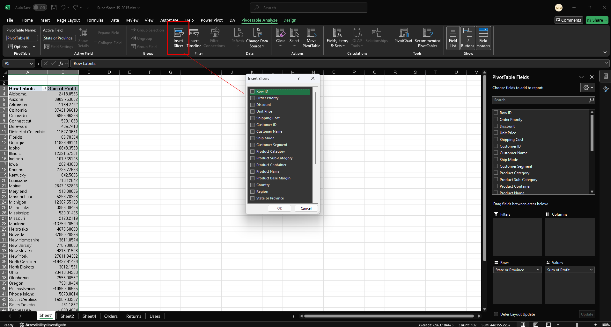
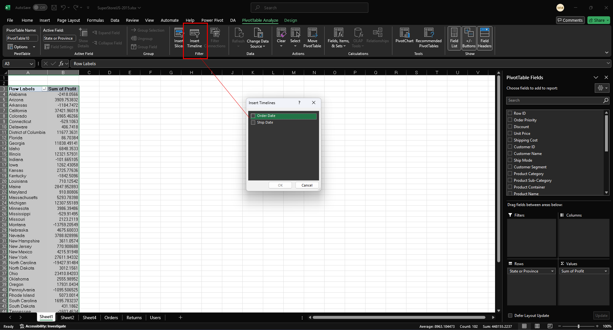
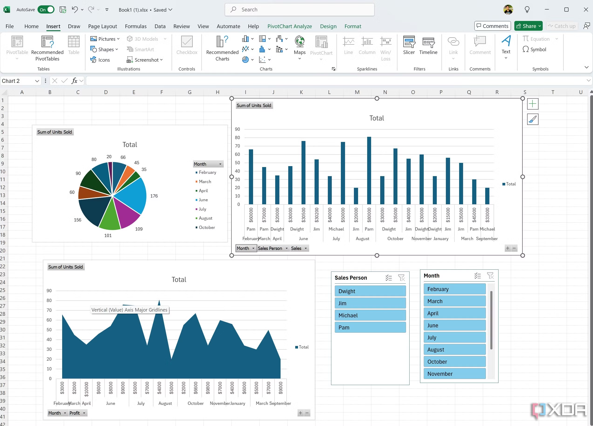

# 🔄 Lesson 5: Excel Pivot Tables and Pivot Charts

**(⏳ Estimated Duration: 2 hours)**

---

## 🎯 Learning Objectives:

*   Understand the purpose and power of Pivot Tables for data summarization and analysis.
*   Learn how to create, modify, and format Pivot Tables effectively.
*   Master filtering, sorting, and grouping data within Pivot Tables.
*   Create Pivot Charts to visualize Pivot Table data dynamically.
*   Gain foundational knowledge of building interactive dashboards using Pivot Tables and Charts.

---

## 📚 Topics Covered:

### 1. Introduction to Pivot Tables: Summarizing Data Dynamically

*   **What are Pivot Tables?** Powerful tools to summarize, analyze, explore, and present large amounts of data quickly and easily without using complex formulas.

*   **Creating Pivot Tables:**
    *   Select your source data range or Excel Table.
    *   Go to the `Insert` tab > `PivotTable`.
    *   Choose where to place the Pivot Table (New Worksheet or Existing Worksheet).
    *   Understand the `PivotTable Fields` pane (appears on the right):
        *   **Fields List:** Columns from your source data.
        *   **Areas:** Drag fields into these areas:
            *   **Filters:** Filter the entire table based on selected items.
            *   **Columns:** Creates column headers from the field's unique values.
            *   **Rows:** Creates row labels from the field's unique values.
            *   **Values:** Performs calculations (Sum, Count, Average, etc.) on the data.

    
    *Creating a pivot table from source data showing the Insert tab and dialog box*

*   **Summarizing Data:**
    *   Drag numerical fields to the `Values` area (defaults usually to `SUM`).
    *   Drag categorical fields (text, dates) to `Rows` or `Columns` to group data.
    *   Change the calculation type in the `Values` area (Right-click field > `Value Field Settings...` or Left-click > `Value Field Settings...`) - choose Sum, Count, Average, Max, Min, etc.

    
    *The PivotTable Fields pane showing fields dragged to different areas*

*   **Modifying Pivot Tables:**
    *   Rearrange fields by dragging them between areas or within an area.
    *   Add or remove fields.
    *   Refresh the Pivot Table (`Data` tab > `Refresh All` or Right-click > `Refresh`) if the source data changes.

    
    *Rearranging fields and refreshing the pivot table when source data changes*

*   **Filtering, Sorting, and Grouping:**
    *   **Filtering:** Use the `Filters` area, or click the dropdown arrows on Row/Column labels.
    *   **Sorting:** Click the dropdown arrows on Row/Column labels and choose sort options (A-Z, Z-A, More Sort Options).
    *   **Grouping:** Select items (rows or columns), right-click > `Group`. Especially useful for dates (group by Year, Quarter, Month) or numerical ranges.

    
    *Filtering and sorting options in a Pivot Table*

    
    *Grouping data in a Pivot Table, especially useful for dates*

### 2. Pivot Charts: Visualizing Pivot Table Data

*   **What are Pivot Charts?** Charts linked directly to a Pivot Table. They automatically update when the Pivot Table changes.
*   **Creating Pivot Charts:**
    *   Select any cell within your Pivot Table.
    *   Go to the `PivotTable Analyze` tab (contextual tab) > `Tools` group > `PivotChart`.
    *   Choose the desired chart type (Column, Bar, Pie, Line, etc.).

    
    *Creating a Pivot Chart from an existing Pivot Table*

*   **Formatting Pivot Charts:**
    *   Use the `Design` and `Format` contextual tabs that appear when the chart is selected.
    *   Add/remove chart elements (titles, labels, legend) using the `+` icon next to the chart.
    *   Apply chart styles and colors.
    *   Filter directly on the chart using the interactive field buttons.

    
    *Formatting options for Pivot Charts to enhance visualization*

### 3. Interactive Dashboards Basics

*   **Concept:** Combining multiple Pivot Tables and/or Pivot Charts on a single sheet to provide an interactive overview of data.
*   **Slicers:** User-friendly filter buttons that can control one or multiple Pivot Tables/Charts simultaneously.
    *   Select a Pivot Table.
    *   Go to `PivotTable Analyze` tab > `Filter` group > `Insert Slicer`.
    *   Choose the field(s) you want to filter by.
    *   Connect slicers to multiple Pivot Tables (Right-click slicer > `Report Connections...`).

    
    *Using slicers to filter multiple pivot tables and charts simultaneously*

*   **Timelines:** Special slicers specifically for filtering date fields.
    *   Select a Pivot Table with a date field.
    *   Go to `PivotTable Analyze` tab > `Filter` group > `Insert Timeline`.
    *   Choose the date field.

    
    *Using a timeline to filter date-based data in pivot tables*

*   **Arrangement:** Place Pivot Tables, Charts, Slicers, and Timelines logically on a worksheet to create a dashboard view.

    
    *Example of a simple Excel dashboard using pivot tables, charts, slicers, and timelines*

---

## ✨ Key Takeaways:

> *   **Pivot Tables** are essential for quickly **summarizing and analyzing** large datasets without formulas.
> *   Mastering the **PivotTable Fields pane** (Rows, Columns, Values, Filters) is key to building effective summaries.
> *   **Filtering, sorting, and grouping** allow for deeper exploration within the Pivot Table.
> *   **Pivot Charts** provide dynamic **visualizations** linked directly to Pivot Table data.
> *   **Slicers and Timelines** enable the creation of basic **interactive dashboards**.

---

## 🛠️ Activity: Analyzing Sales Data with Pivots

*   **Goal:** Use Pivot Tables and Pivot Charts to analyze sales trends from a dataset.
*   **Setup:** Use the `Sales Data` sheet created/used in Lesson 4 (or a similar dataset with columns like `SaleDate`, `Region`, `Category`, `Salesperson`, `TotalSale`). Ensure the data is clean and formatted appropriately (especially dates).
*   **Steps:**
    1.  **📊 Create Pivot Table 1 (Sales by Region):**
        *   Create a Pivot Table from the `Sales Data`.
        *   Place `Region` in the `Rows` area.
        *   Place `TotalSale` in the `Values` area (ensure it's `Sum of TotalSale`).
        *   Format the `TotalSale` values as Currency.
    2.  **📈 Create Pivot Chart 1:**
        *   With Pivot Table 1 selected, insert a `PivotChart` (e.g., a Clustered Column or Bar chart).
        *   Add a meaningful chart title (e.g., "Total Sales by Region").
    3.  **📅 Create Pivot Table 2 (Sales by Month/Year):**
        *   Create a *second* Pivot Table from the *same* `Sales Data` on the same sheet (or a new one).
        *   Place `SaleDate` in the `Rows` area. Excel will likely automatically group it by Years, Quarters, and Months. (If not, right-click the dates > `Group` > Choose Years and Months).
        *   Place `TotalSale` in the `Values` area (`Sum of TotalSale`, formatted as Currency).
    4.  **📉 Create Pivot Chart 2:**
        *   With Pivot Table 2 selected, insert a `PivotChart` (e.g., a Line chart is good for time trends).
        *   Add a title (e.g., "Sales Trend Over Time").
    5.  **🔪 Insert Slicers:**
        *   Select Pivot Table 1.
        *   Insert a `Slicer` for `Category`.
        *   Insert a `Slicer` for `Salesperson`.
    6.  **🔗 Connect Slicers:**
        *   Right-click the `Category` slicer > `Report Connections...` > Check the boxes for *both* PivotTable1 and PivotTable2.
        *   Repeat for the `Salesperson` slicer.
    7.  **🖱️ Interact:**
        *   Arrange the Pivot Charts and Slicers on the sheet to create a simple dashboard layout.
        *   Click different categories or salespeople on the slicers and observe how *both* Pivot Tables and *both* Pivot Charts update instantly.
    8.  **(Optional) Grouping:** In Pivot Table 1, try grouping Regions if applicable (e.g., group states into larger territories).
    9.  **(Optional) Filtering:** Apply a filter directly within one of the Pivot Tables (e.g., filter Pivot Table 2 to show only a specific year) and see how its corresponding chart updates.
    10. 💾 **Save:** Save your workbook.

---
