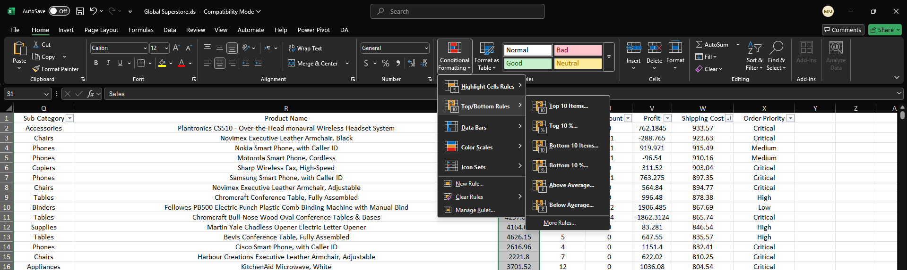
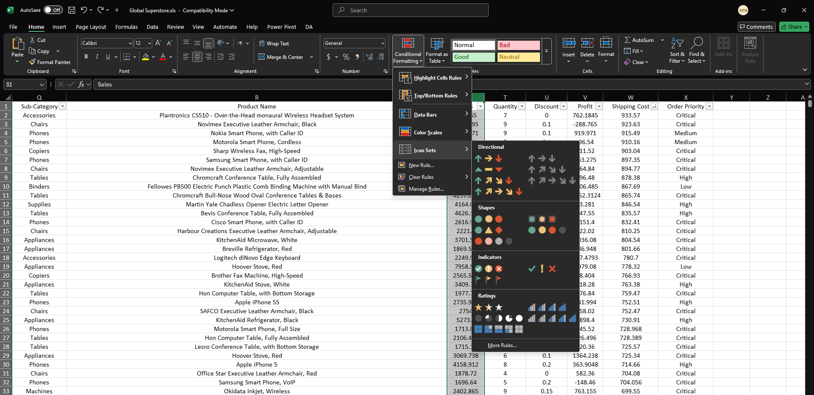

# 📈 Lesson 6: Data Visualization and Dashboards in Excel

## 🎯 Learning Objectives:

* Learn to create various standard chart types in Excel for effective data visualization.
* Understand when to use different chart types (Column, Bar, Line, Pie, Scatter, Histogram).
* Apply conditional formatting and data bars to highlight trends and patterns directly within cells.
* Combine multiple elements (charts, Pivot Tables, slicers) to build interactive dashboards.

---

## 📚 Topics Covered:

### 1. Creating Effective Visualizations: Choosing the Right Chart

* **Standard Chart Types (Insert Tab > Charts Group):**

  * 📊 **Column Charts:** Ideal for comparing values across different categories or showing changes over a short period. Variations include Clustered, Stacked, 100% Stacked.

  
  *Examples of different column chart types and when to use them*

  * 📊 **Bar Charts:** Similar to column charts but with horizontal bars. Good for comparing many categories or when category labels are long.

  
  *Bar charts showing comparisons across categories with long labels*

  * 📉 **Line Graphs:** Excellent for showing trends over time (days, months, years) or continuous data. Connects data points with lines.

  
  *Line graphs showing data trends over time periods*

  * 🧁 **Pie Charts:** Used to show proportions of a whole (parts of 100%). Best for a small number of categories. Avoid using if categories are numerous or very similar in size. Variations include Doughnut charts.

  
  *Pie and doughnut charts showing proportional data distributions*

  * ⚛️ **Scatter Plots (XY Charts):** Show the relationship or correlation between two numerical variables. Each point represents an observation based on two values.

  
  *Scatter plots showing correlations between two variables*

  * 📊 **Histograms:** Visualize the distribution of a single numerical variable by grouping data into bins (ranges) and showing the frequency (count) within each bin. (Found under Statistical charts).

  
  *Histograms showing the distribution of values in different bins*
* **Chart Elements & Formatting:**

  * Adding/Modifying Titles, Axis Labels, Data Labels, Legends (Use the `+` icon or `Chart Design` tab).
  * Changing Colors, Styles, and Layouts (`Chart Design` tab).
  * Adjusting Axes Scales and Formatting (`Format Axis` pane - double-click axis).

  
  *Chart formatting options showing how to add and modify chart elements*

### 2. Conditional Formatting & Data Bars: In-Cell Visualization

* **Conditional Formatting (Home Tab > Styles Group):** Apply formatting (colors, icons, bars) to cells based on their values or specific rules.

  * **Highlight Cells Rules:** Greater than, less than, between, equal to, text that contains, duplicate values, etc.

  
  *Using highlight cell rules to identify values meeting specific conditions*

  * **Top/Bottom Rules:** Top 10 items, Bottom 10%, Above/Below Average, etc.

  
  *Applying top/bottom rules to highlight highest and lowest values*

  * **Data Bars:** Adds colored bars directly within cells, representing the value relative to others in the selected range. Provides a quick visual comparison.

  
  *Data bars showing relative values within cells*

  * **Color Scales:** Applies a color gradient across cells based on their values (e.g., green for high, red for low).

  
  *Color scales showing value distribution with color gradients*

  * **Icon Sets:** Adds small icons (arrows, shapes, indicators) to cells based on their values.

  
  *Icon sets visually indicating values with directional or rating symbols*

  * **Managing Rules:** Edit, delete, or change the order of applied rules.

  
  *Managing multiple conditional formatting rules in a worksheet*

### 3. Introduction to Excel Dashboards: Bringing It All Together

* **What is a Dashboard?** A visual display (often on a single sheet) of the most important information needed to achieve one or more objectives; consolidated and arranged so the information can be monitored at a glance.

  
  *Example of a complete Excel dashboard showing multiple data visualizations*
* **Key Components:**

  * **Data Source:** Clean, well-structured data (often an Excel Table).
  * **Analysis Layer:** Pivot Tables or formulas used to summarize the source data.
  * **Presentation Layer:** Charts, Key Performance Indicators (KPIs), and other visuals derived from the analysis layer.
  * **Interactivity:** Slicers and Timelines (as seen in Lesson 5) to allow users to filter the dashboard dynamically.

  
  *The different layers of a dashboard showing how data flows from source to presentation*
* **Design Principles (Basic):**

  * **Audience & Purpose:** Who is it for? What questions should it answer?
  * **Layout:** Organize charts and elements logically. Place important info prominently (top-left often).
  * **Clarity:** Use clear titles and labels. Avoid clutter.
  * **Consistency:** Use consistent colors and formatting.

  
  *Examples of good and poor dashboard design practices*
* **Combining Elements:** Arrange Pivot Charts, standard charts (potentially linked to summary data derived from Pivot Tables or formulas), Slicers, and Timelines on a single worksheet.

  * Ensure Slicers/Timelines are connected to the relevant Pivot Tables/Charts (`Report Connections...`).

  
  *Connecting slicers to multiple pivot tables and charts in a dashboard*

---

## ✨ Key Takeaways:

> * Choosing the **right chart type** is crucial for conveying information effectively.
> * **Conditional Formatting** and **Data Bars** provide quick, in-cell visual insights.
> * Dashboards combine **data, analysis, and visualization** into a consolidated, interactive view.
> * **Slicers and Timelines** are key to making dashboards interactive.

---

## 🛠️ Activities: Data Visualization with Real Datasets

### Activity 1: Wine Quality Analysis Dashboard

* **Datasets:** `winequality-red.csv` and `winequality-white.csv` (found in Dataset/Lesson6 folder)
* **Goal:** Create a comprehensive dashboard comparing red and white wine characteristics and their quality ratings.
* **Steps:**
  1. 📥 **Import Data:** Import both wine quality datasets into separate worksheets in a new workbook.
  2. 💾 **Save:** Save the workbook as `Wine_Quality_Dashboard.xlsx`.
  3. 📊 **Prepare Summary Tables:**
     * Create a worksheet named "Analysis" where you'll prepare summary statistics for both wine types
     * Calculate min, max, average, and median for key properties (alcohol content, acidity, sugar, etc.)
     * Create a combined dataset with a "Type" column (Red/White) for some of the visualizations
  4. 📈 **Quality Distribution Chart:**
     * Create a histogram for quality ratings for both red and white wine
     * Place them side by side for easy comparison
     * Add appropriate titles and axis labels
  5. 📊 **Alcohol Content vs. Quality:**
     * Create a scatter plot showing the relationship between alcohol content (x-axis) and quality rating (y-axis)
     * Use different colors for red and white wine data points
     * Add a trendline to visualize correlation
  6. 🧪 **Chemical Properties Comparison:**
     * Create a radar chart comparing the average values of key chemical properties (acidity, pH, density, etc.) between red and white wines
     * Scale the values appropriately so all properties can be meaningfully compared
  7. 🔍 **Quality Factor Analysis:**
     * Create a multiple bar chart showing the average values of each property for different quality ratings
     * This helps identify which factors most strongly correlate with higher quality
  8. 📊 **Conditional Formatting Heatmap:**
     * Create a correlation matrix between all wine properties
     * Apply color scale conditional formatting to highlight strong positive and negative correlations
  9. 🔮 **Interactive Dashboard:**
     * Create a new worksheet named "Dashboard"
     * Arrange the most insightful charts on this sheet
     * Add slicers for quality rating and wine type
     * Create a dynamic title that updates based on slicer selections
  10. 🎨 **Dashboard Design:**
      * Apply a consistent color scheme (perhaps using wine-related colors)
      * Add text boxes with key insights discovered from your analysis
      * Format all charts with clear titles and labels
      * Consider adding a small image of wine glasses for visual appeal

### Activity 2: NYC Airbnb Visualization Project

* **Dataset:** `AB_NYC_2019.csv` (found in Dataset/Lesson6 folder)
* **Goal:** Create an interactive dashboard to visualize Airbnb rental patterns across New York City neighborhoods.
* **Steps:**
  1. 📥 **Import Data:** Import the NYC Airbnb dataset into a new Excel workbook.
  2. 💾 **Save:** Save the workbook as `NYC_Airbnb_Visualization.xlsx`.
  3. 🧹 **Data Preparation:**
     * Create a pivot table to summarize key metrics by neighborhood and room type
     * Calculate average price, availability, and number of reviews
     * Create a calculated field for review frequency (number of reviews divided by calculated age of listing)
  4. 🗺️ **Neighborhood Price Comparison:**
     * Create a column chart showing average prices by neighborhood
     * Use conditional formatting with color gradient to highlight the most expensive areas
     * Sort neighborhoods from highest to lowest average price
  5. 📊 **Room Type Distribution:**
     * Create a pie chart showing the distribution of room types (Entire home/apt, Private room, Shared room)
     * Create a second chart showing how this distribution varies across different neighborhoods or boroughs
  6. 📈 **Price Range Analysis:**
     * Create a histogram showing the distribution of prices across the entire dataset
     * Add reference lines or color coding to indicate different price brackets (budget, mid-range, luxury)
  7. 🔍 **Availability Patterns:**
     * Create a scatter plot with price on the y-axis and availability_365 on the x-axis
     * Use different colors to represent different neighborhoods or boroughs
     * Add a trendline to see if there's a relationship between price and availability
  8. 📊 **Review Analysis:**
     * Create a line chart showing the relationship between number of reviews and listing age
     * Create a bubble chart where bubble size represents the number of reviews and position represents price and minimum nights
  9. 🎛️ **Interactive Dashboard:**
     * Create a new worksheet named "NYC Airbnb Dashboard"
     * Arrange the most insightful charts in a logical layout
     * Add slicers for neighborhood group (borough), room type, and price range
     * Add a timeline slicer if you've calculated or extracted posting dates
  10. 🏙️ **Final Touches:**
      * Create a summary statistics section showing:
        * Total number of listings
        * Average price
        * Most common room type
        * Most reviewed neighborhood
      * Apply consistent formatting across all charts
      * Add explanatory text boxes highlighting key insights
      * Create a dynamic title that updates based on slicer selections

### Bonus Challenge: Advanced Visualization Techniques

* Create a dynamic map visualization of NYC neighborhoods using Excel's 3D Maps feature
* Build an automatic price prediction calculator using trendline equations from your scatter plots
* Create animated charts that show how Airbnb listings have evolved over time (if the dataset includes historical data)
* Design a custom color palette that matches Airbnb's branding and apply it consistently across all visualizations
* Add form controls (buttons, checkboxes) to toggle between different visualization views

---
